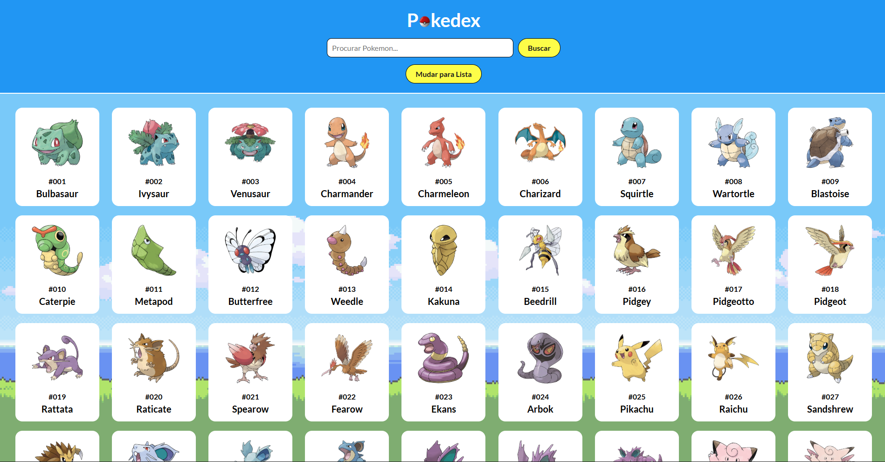

# Pokédex 📖


Uma aplicação web interativa, no estilo de uma Pokédex, que exibe uma lista completa de Pokémon e permite a exploração de suas informações detalhadas. O projeto foi desenvolvido com foco em boas práticas de código e uma experiência de usuário agradável.

### 🎮 [Acesse a demonstração ao vivo aqui!](https://wsfrontend-fabrica252.vercel.app/)

---



---

## ✨ Funcionalidades Principais

- **Listagem Completa:** Visualização de múltiplos Pokémon com carregamento dinâmico.
- **Busca em Tempo Real:** Filtre e encontre Pokémon específicos digitando seus nomes.
- **Página de Detalhes:** Clique em um Pokémon para ver informações detalhadas em uma página dedicada.

## 🛠️ Tecnologias Utilizadas

Este projeto foi construído utilizando tecnologias web fundamentais e consumindo uma API externa:

- **HTML5:** Para a estrutura e semântica do conteúdo.
- **CSS3:** Para estilização, layout e responsividade.
- **TypeScript/JavaScript (ES6+):** Para a lógica de programação, interatividade e manipulação do DOM.
- **PokéAPI:** A API RESTful utilizada como fonte de dados para todas as informações dos Pokémon.

## 🚀 Como Executar o Projeto Localmente

Para executar uma cópia deste projeto em sua máquina local, siga os passos abaixo:

1.  **Clone o repositório:**

    ```bash
    git clone [https://github.com/Moreira005/wsFrontend-Fabrica25.2.git](https://github.com/Moreira005/wsFrontend-Fabrica25.2.git)
    ```

2.  **Navegue até o diretório:**

    ```bash
    cd wsFrontend-Fabrica25.2
    ```

3.  **Abra o arquivo `index.html`:**
    - Basta abrir o arquivo `index.html` diretamente no seu navegador de preferência.

## 📄 Licença

Este projeto está sob a licença MIT. Veja o arquivo [LICENSE](LICENSE) para mais detalhes.

---

_Desenvolvido por Gustavo Moreira._
